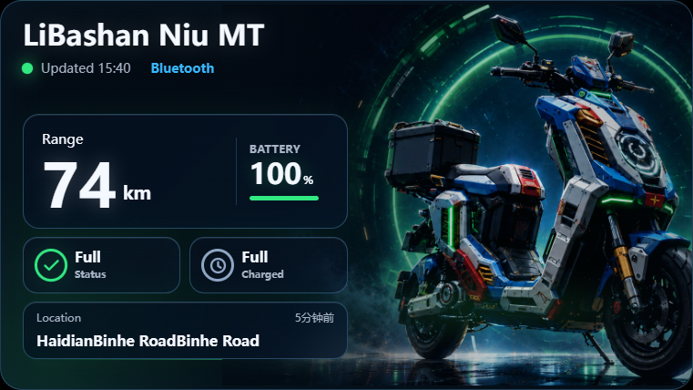
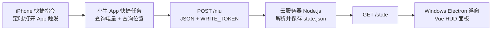
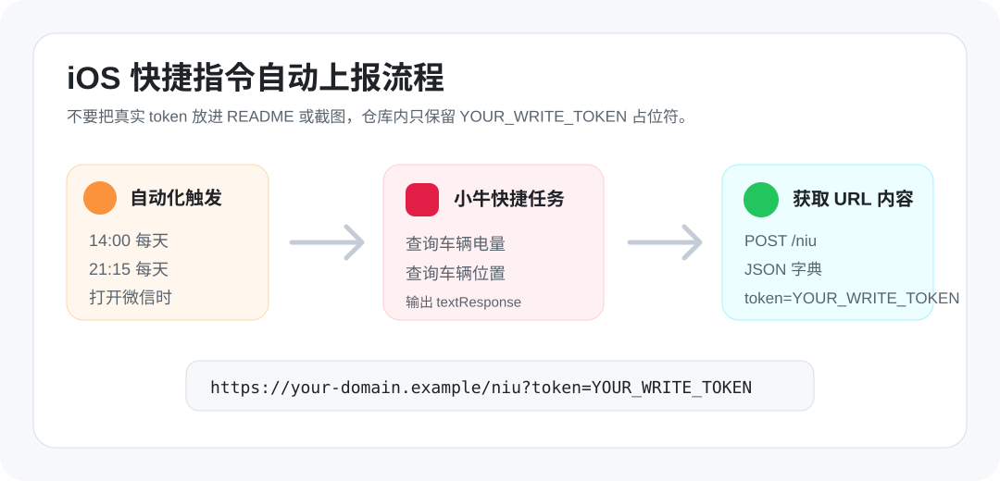

# LiBashan Niu MT 桌面浮窗


基于 **iOS 快捷指令 + 云端 Node.js 接口 + Windows Electron 浮窗** 构建的小牛电动车状态面板。手机定时读取小牛 App 快捷任务结果，云端保存最新状态，Windows 桌面以悬浮小组件显示续航、电量、充电状态、预计充满时间和车辆位置。



## ✨ 项目特色

- 🛵 **桌面浮窗体验**：Electron 透明无边框窗口，置顶显示，不占用浏览器标签页。
- ⚡ **自动刷新电量**：iPhone 快捷指令定时执行小牛查询任务，并自动推送到云端。
- 🔋 **低打扰提醒**：面板常驻桌面，电量、续航和充电状态一眼可见。
- 🧭 **位置集成**：支持从小牛快捷任务解析车辆位置和更新时间。
- 🪟 **Windows 友好**：支持锁定 16:9 比例缩放、圆角浮窗、桌面快捷方式启动。
- 🔐 **凭据隔离**：真实服务器地址和写入 token 不进入仓库，通过环境变量配置。

## ✨ 功能特性

- 📊 **车辆状态**：显示剩余电量、预计续航、充电中/已充满/低电量状态。
- ⏱️ **充满时间**：电量达到 100% 时自动显示 `Full`，避免仍显示 Charging。
- 📍 **车辆位置**：解析「Vehicle 3分钟前 is located at ...」一类文本。
- 🎨 **动效界面**：卡片入场、状态呼吸、车辆背景轻微漂浮，保持科幻 HUD 风格。
- ☁️ **云端桥接**：Node.js 原生 HTTP 服务接收 iOS POST，提供 `/state` 给桌面端读取。
- 🧩 **可本地开发**：桌面端使用 Vite + Vue，云端无第三方运行依赖。

## 🏗️ 技术架构



## 📱 iOS 快捷指令示意



详细步骤见 [docs/ios-shortcuts.md](docs/ios-shortcuts.md)。

## 📦 目录结构

```text
niu-mt-dashboard/
├─ cloud/                 # 云端 Node.js 接收服务
├─ desktop/               # Windows Electron + Vue 浮窗
├─ docs/                  # 截图与配置说明
└─ README.md
```

## 🚀 云端运行

```bash
cd cloud
npm install
NIU_TOKEN="YOUR_WRITE_TOKEN" PORT=8787 npm start
```

接口：

- `POST /niu?token=YOUR_WRITE_TOKEN`：iOS 快捷指令写入车辆状态。
- `GET /state`：Windows 桌面端读取最新状态。
- `GET /health`：健康检查。

## 🖥️ Windows 桌面端运行

```powershell
cd desktop
npm install
copy .env.example .env.local
```

编辑 `desktop/.env.local`：

```env
VITE_NIU_STATE_URL=https://your-domain.example/state
NIU_STATE_URL=https://your-domain.example/state
```

开发运行：

```powershell
npm run build
npm run desktop
```

创建桌面图标：

```powershell
powershell -ExecutionPolicy Bypass -File .\create-desktop-shortcut.ps1
```

## 🔐 安全说明

不要把 GitHub 账号密码、服务器 SSH 密码、真实写入 token、包含 token 的手机截图提交到仓库。公开文档中统一使用 `YOUR_WRITE_TOKEN`、`your-domain.example` 这类占位符。

如果 token 曾经出现在截图或公开仓库中，建议立刻在服务器上更换 `NIU_TOKEN` 并重启服务。
